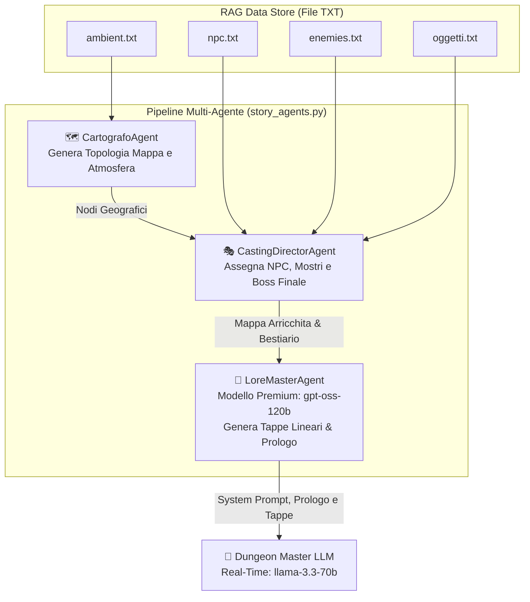
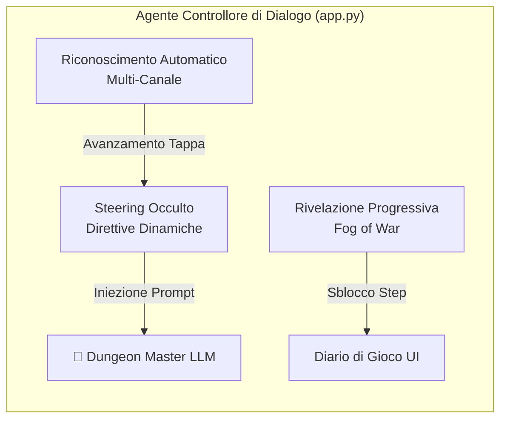

# 🧠 MORPHEUS GENESIS — Advanced Agentic AI RPG Engine


> **Progetto Universitario per il corso di Applicazioni Intelligenti (Anno III)**  
> *Un motore di gioco di ruolo testuale di nuova generazione basato su un'architettura Multi-Agente (Agentic AI), Retrieval-Augmented Generation (RAG) modulare e motore di combattimento neuro-simbolico.*

---

## 📖 Indice dei Contenuti
1. [Panoramica del Progetto](#-panoramica-del-progetto)
2. [Architettura Multi-Agente (Pipeline di Creazione)](#-architettura-multi-agente-pipeline-di-creazione)
3. [Motore Neuro-Simbolico di Combattimento (`combat_engine.py`)](#-motore-neuro-simbolico-di-combattimento-combat_enginepy)
4. [Sistema RAG Modulare (Mattoncini Narrative)](#-sistema-rag-modulare-mattoncini-narrativi)
5. [Sistema di Steering Occulto, Tappe Strutturate e Rivelazione Progressiva](#-sistema-di-steering-occulto-tappe-strutturate-e-rivelazione-progressiva)
6. [Gestione LLM, Rotazione Chiavi e Fallback](#-gestione-llm-rotazione-chiavi-e-fallback)
7. [Interfaccia Web ed Esperienza Utente (UI/UX)](#-interfaccia-web-ed-esperienza-utente-uiux)
8. [Struttura delle Cartelle e Asset Visivi](#-struttura-delle-cartelle-e-asset-visivi)
9. [Installazione e Configurazione](#-installazione-e-configurazione)
10. [Guida all'Uso e Modalità di Esecuzione](#-guida-alluso-e-modalità-di-esecuzione)
11. [Documentazione delle API REST](#-documentazione-delle-api-rest)

---

## 🌟 Panoramica del Progetto

**Morpheus Genesis** supera i limiti tradizionali dei chatbot di ruolo (che tendono a perdere coerenza spaziale o ad improvvisare risposte arbitrarie) introducendo un **sistema di orchestrazione a tre livelli**:
- **Geografia e Trama Lineare Bloccata**: Il mondo non viene inventato dal nulla ad ogni turno, ma viene pre-generato da un team di Agenti IA autonomi prima dell'avvio della partita.
- **Narrativa Interattiva e Reattiva**: Il Dungeon Master (DM) interviene con uno stile "botta e risposta" rapido (massimo 2-3 frasi) e vincolato alle regole di avanzamento della storia.
- **Calcolo Matematico Separato dall'IA**: I tiri di dado ($d20$), i modificatori di statistica e i danni non sono affidati alle allucinazioni del modello linguistico, ma calcolati deterministicamente da un motore di combattimento simbolico scritto in Python.

---

## 🤖 Architettura Multi-Agente (Pipeline di Creazione)

Prima che il giocatore legga una singola riga del prologo, il modulo [`story_agents.py`](file:///c:/Users/mikyv/Desktop/COSE/UNIVERSIT%C3%80/TERZO%20ANNO/APPLICAZIONI%20INTELLIGENTI/PROGETTO/story_agents.py) attiva una pipeline di collaborazione tra **tre agenti autonomi specializzati**:



### 1. 🗺️ Il Cartografo (`CartografoAgent`)
- **Compito**: Analizza la dimensione della mappa scelta dall'utente (`small`, `medium`, `large`).
- **Funzionamento**: Estrae dinamicamente le ambientazioni dal database RAG [`ambient.txt`](file:///c:/Users/mikyv/Desktop/COSE/UNIVERSIT%C3%80/TERZO%20ANNO/APPLICAZIONI%20INTELLIGENTI/PROGETTO/ambient.txt) e costruisce una topologia a nodi interconnessi con punti cardinali e coordinate di profondità (`[CENTRO]`, `[NORD]`, `[EST]`, `[OVEST]`, `[PROFONDITÀ]`).

### 2. 🎭 Il Direttore del Casting (`CastingDirectorAgent`)
- **Compito**: Assegna la popolazione del mondo e definisce l'obiettivo di vittoria.
- **Funzionamento**: Prende la mappa topologica del Cartografo e distribuisce strategicamente NPC ([`npc.txt`](file:///c:/Users/mikyv/Desktop/COSE/UNIVERSIT%C3%80/TERZO%20ANNO/APPLICAZIONI%20INTELLIGENTI/PROGETTO/npc.txt)) e Nemici ([`enemies.txt`](file:///c:/Users/mikyv/Desktop/COSE/UNIVERSIT%C3%80/TERZO%20ANNO/APPLICAZIONI%20INTELLIGENTI/PROGETTO/enemies.txt)) nelle varie zone, garantendo alternanza tra zone sicure e zone pericolose.  
- **Elezione del Boss Finale**: Seleziona il mostro di grado più elevato e lo designa ufficialmente come **👑 Boss Finale e Obiettivo Supremo della Campagna**, posizionandolo nell'area più remota.

### 3. 📜 Il Maestro di Lore (`LoreMasterAgent`) — *Modello Premium*
- **Compito**: Sintesi narrativa, generazione della linearità e iniezione delle regole di masteraggio.
- **Funzionamento**: Utilizza un modello ad altissima capacità di ragionamento (**`openai/gpt-oss-120b`**) per costruire un System Prompt blindato.
- **Costruzione Deterministica delle Tappe Strutturate (`tappe_strutturate`)**: Per garantire che **ogni singolo NPC selezionato e ogni creatura/nemico assegnato abbia uno scopo obbligatorio nella storia**, l'agente analizza la topologia della mappa e costruisce una sequenza rigorosa di step (`[Tappa X: Luogo - Personaggio/Nemico]`). Nessuna entità è una comparsa inutile: ognuna rappresenta una sfida di dialogo, indagine o combattimento marziale lungo il percorso che conduce alla tana del **👑 Boss Finale e Obiettivo Supremo**.

---

## ⚔️ Motore Neuro-Simbolico di Combattimento (`combat_engine.py`)

Uno dei maggiori problemi dei giochi di ruolo basati su LLM è l'incoerenza matematica e la tendenza all'invincibilità o alla morte ingiustificata. Morpheus Genesis risolve questo problema con il modulo [`combat_engine.py`](file:///c:/Users/mikyv/Desktop/COSE/UNIVERSIT%C3%80/TERZO%20ANNO/APPLICAZIONI%20INTELLIGENTI/PROGETTO/combat_engine.py):

1. **Rilevamento Azioni Marziali/Magiche**: Quando l'utente invia un input, il backend controlla tramite parole chiave marziali e incrocio con l'inventario del giocatore se si sta verificando un attacco (`_is_combat_trigger`).
2. **Lancio Simbolico del Dado ($d20$)**: Il motore Python lancia un dado a 20 facce reale (`random.randint(1, 20)`) e calcola il modificatore di caratteristica in base alle statistiche estratte dalla scheda (`FORZA`, `DESTREZZA`, `INTELLIGENZA`).
3. **Gestione Successi e Fallimenti Critici**:
   - **💥 Fallimento Critico ($d20 = 1$)**: Il colpo va a vuoto in modo disastroso; il nemico risponde contrattaccando con danni maggiorati.
   - **✨ Successo Critico ($d20 = 20$)**: Il colpo infligge danni critici massimizzati; il nemico viene stordito o respinto.
4. **Tag di Sincronizzazione Danni (`[DANNI: X]`)**: Il motore inietta nel prompt per il DM il risultato esatto del dado e i danni subiti. Il DM si limita a raccontare narrativamente l'esito visivo dello scontro e conclude il messaggio con il tag esatto `[DANNI: X]`, che il frontend intercetta per aggiornare la barra della salute in tempo reale.

---

## 🧱 Sistema RAG Modulare (Mattoncini Narrativi)

Il gioco non si basa esclusivamente sulla conoscenza pre-addestrata dell'IA, ma carica dati contestuali strutturati (Retrieval-Augmented Generation) al momento dell'avvio:

| File RAG | Contenuto e Funzione |
| :--- | :--- |
| **`player.txt`** | Contiene gli archetipi delle classi giocabili (Guerriero, Ramingo, Paladino, Mago delle Ombre, ecc.) con background storici e abilità uniche. |
| **`ambient.txt`** | Definisce i luoghi del mondo (es. *La Città delle Cinque Porte*, *Abisso di Kar-Dum*), con descrizioni atmosferiche, punti di interesse e pericoli ambientali. |
| **`npc.txt`** | Catalogo di personaggi non giocanti che abitano le zone, completi di tratti caratteriali, segreti e indizi di trama. |
| **`enemies.txt`** | Bestiario di creature e mostri (es. *Fenice Cinerea*, *Basilisco di Pietrascura*), con comportamenti di lotta e tag di identificazione Boss. |
| **`oggetti.txt`** | Reliquie, armi magiche e pozioni equipaggiabili che arricchiscono l'inventario e sbloccano opzioni narrative uniche. |

---

## 🎯 Sistema di Steering Occulto, Tappe Strutturate e Rivelazione Progressiva

Morpheus Genesis implementa un avanzato **Agente Controllore di Dialogo** in [`app.py`](file:///c:/Users/mikyv/Desktop/COSE/UNIVERSIT%C3%80/TERZO%20ANNO/APPLICAZIONI%20INTELLIGENTI/PROGETTO/app.py) che risolve il compromesso tra libertà del giocatore e coerenza di una campagna scriptata:



### 1. 🎭 Illusione di Libertà (Carta Bianca) e Steering Occulto
Il giocatore deve avere la percezione costante di possedere totale libertà d'azione e scelta (*carta bianca*). Tuttavia, prima di ogni chiamata narrativa, il backend inietta dinamicamente le **Direttive di Steering Scriptato (`steering_prompt`)** relative all'esatta **Tappa Obbligatoria Attuale**:
- **Indirizzamento Invisibile**: Qualsiasi azione o domanda ponga il giocatore, l'IA fa evolvere i dialoghi degli NPC, gli eventi atmosferici e le reazioni ambientali in modo da indirizzarlo e spingerlo ad affrontare l'obiettivo dello step corrente.
- **Blocco Spostamenti Immersivo**: Se il giocatore tenta di recarsi anzitempo in zone avanzate o di saltare un NPC/Nemico chiave, il Master impedisce il passaggio narrativamente (es. *una guardia reale esige il lasciapassare di un NPC*, *un cancello runico è sigillato dalla magia del nemico locale*, *un evento improvviso richiama l'attenzione sul dovere immediato*) senza mai emettere messaggi meta-game o sistemici.

### 2. 🔗 Struttura Completa degli Step (Luogo / Coinvolto / Obiettivo)
Nel Diario di Gioco, ogni tappa possiede una propria scheda formattata che associa in modo inequivocabile gli elementi narrativi al mondo di gioco:
```text
[👑 Tappa 6 (BOSS FINALE E OBIETTIVO SUPREMO): PROFONDITÀ - Malakor il Drago d'Ombra]
📍 Luogo / Zona: L'Abisso delle Anime (PROFONDITÀ)
👑 Boss Finale: **Malakor il Drago d'Ombra**
📖 Punto della Narrazione: Raggiungi la tana finale e sconfiggi il Boss in combattimento per completare la campagna
⚡ Stato Tappa: 🔒 Bloccata (Da Completare in Ordine)
```

### 3. 👁️ Rivelazione Progressiva nel Diario (Fog of War)
Per preservare il mistero dell'avventura ed evitare spoiler sui successivi NPC o Boss, il Diario di Gioco mostra **esclusivamente gli step già completati (`✅ Completata`) e il singolo step attualmente in corso (`⏳ In Corso / Obiettivo Attuale`)**.  
Tutte le tappe future restano nascoste e si sbloccano automaticamente **una dopo l'altra man mano che il giocatore completa i rispettivi obiettivi**.

### 4. ⚡ Riconoscimento Automatico Multi-Canale (`_check_advance_step`)
Il completamento e lo sblocco degli step sono intercettati automaticamente attraverso tre canali simultanei e complementari:
1. **Riconoscimento Interattivo Naturale (Narrativo)**: Ad ogni turno, il sistema analizza l'input del giocatore (`player_input`) e la risposta del DM (`dm_reply`). Se la tappa richiede di parlare, collaborare, incontrare o esplorare con il personaggio/luogo associato, e la narrazione rispecchia un dialogo o un avanzamento (*parli*, *risponde*, *incontri*, *chiedi*, *rivela*, *ottieni*), la tappa viene riconosciuta e superata in automatico.
2. **Risoluzione Marziale Locale (`combat_engine`)**: Se la tappa richiede di sconfiggere un nemico ostile o mini-boss, l'uccisione marziale tramite dadi d20 attiva immediatamente la transizione allo step successivo.
3. **Tag di Completamento (`[STEP_COMPLETATO]`)**: L'IA narratrice, quando riconosce la soddisfazione dell'obiettivo, emette alla fine del messaggio il tag esatto che il backend intercetta e ripulisce dal testo mostrato all'utente.

---

## ⚡ Gestione LLM, Rotazione Chiavi e Fallback

Il motore è progettato per garantire un'alta disponibilità e reattività costante anche durante picchi di richieste o limitazioni delle API:

```python
# .env - Configurazione differenziata dei modelli
MODEL_NAME=llama-3.3-70b-versatile          # Modello veloce per il gioco in tempo reale
STORY_MODEL_NAME=openai/gpt-oss-120b        # Modello ragionatore per la creazione della mappa
```

- **Rotazione Automatica delle Chiavi (`GROQ_API_KEYS`)**: In [`app.py`](file:///c:/Users/mikyv/Desktop/COSE/UNIVERSIT%C3%80/TERZO%20ANNO/APPLICAZIONI%20INTELLIGENTI/PROGETTO/app.py#L28), è possibile configurare più chiavi API separate da virgola. Se una chiamata riceve un errore `429 Rate Limit`, il wrapper `chiama_ia()` passa istantaneamente alla chiave successiva nell'elenco ed esegue un nuovo tentativo trasparente per l'utente.
- **Resilienza Neuro-Simbolica (Fallback)**: Qualora tutte le chiavi API dovessero esaurirsi contemporaneamente, il sistema non va in crash ma attiva un generatore neuro-simbolico di emergenza che sintetizza la storia partendo direttamente dai mattoncini RAG.

---

## 🎨 Interfaccia Web ed Esperienza Utente (UI/UX)

L'applicazione offre un'interfaccia **Dark Fantasy moderna e immersiva**, progettata con cura nei minimi dettagli visivi:

### 🏠 Homepage di Creazione (`dnd_homepage.html`)
- Selezione interattiva dell'archetipo del personaggio tramite schede illustrate.
- **Configuratore di Mondo**: Scelta della dimensione della mappa (`Small - 4 Città`, `Medium - 6 Città`, `Large - 10 Città`).
- **Selettore del Tema Narrativo**: Dark Fantasy, Sci-Fi Cyberpunk, Lovecraftian Horror, High Fantasy o Post-Apocalittico.
- **Selettore della Difficoltà**: Story (focus narrativo), Normal (bilanciato) o Hardcore (danni letali e risorse scarse).

### 🎮 Scheda di Gioco (`dnd_game.html`)
- **Barra HP Dinamica & Effetto Danni**: Barra dei Punti Ferita con transizione cromatica (Verde $\rightarrow$ Giallo $\rightarrow$ Rosso) ed effetto *Screen Flash* rosso istantaneo quando il personaggio subisce colpi.
- **Pannello Personaggio a Scomparsa (`#char-identity`)**: I dettagli del personaggio (Background, Allineamento, Segreti) sono compressi per lasciare spazio al gioco. Cliccando sul ritratto del personaggio o sull'indicatore sotto di esso, la scheda si espande con una transizione fluida.
- **Il Diario Interattivo (`#diary-content`)**: Raccoglie in tempo reale tutti i contenuti del RAG suddivisi in schede navigabili:
  - 👑 **Bestiario (Nemici & Boss)**: Card illustrate dei mostri incontrati o noti. Il Boss Finale si distingue con un'esclusiva aura dorata pulsante (`.boss-aura`).
  - 📜 **Personaggi Incontrati (NPC)**: Elenco di alleati e informatori con le relative biografie.
  - 🗺️ **Luoghi Esplorati**: Card dei luoghi visitati della mappa.
  - 🎒 **Inventario**: Lista degli oggetti magici ed equipaggiamento posseduto.
  - 🎯 **Percorso e Tappe Obbligatorie (Fog of War)**: Scheda interattiva che mostra la roadmap strutturata (Luogo, Personaggio/Nemico e Obiettivo Narrativo) che sblocca progressivamente le tappe una dopo l'altra man mano che vengono superate durante il gioco.

---

## 📂 Struttura delle Cartelle e Asset Visivi

```text
PROGETTO/
├── .env                       # Variabili d'ambiente (Chiavi API Groq e Modelli)
├── app.py                     # Server Flask, Router REST API e gestione CLI
├── story_agents.py            # Pipeline Multi-Agente (Cartografo, Casting, LoreMaster)
├── combat_engine.py           # Motore matematico e di combattimento neuro-simbolico
├── dnd_homepage.html          # Interfaccia Web - Schermata iniziale e creazione
├── dnd_game.html              # Interfaccia Web - Tavolo da gioco, Chat e Diario
├── player.txt                 # RAG: Database Archetipi Giocatore
├── ambient.txt                # RAG: Database Luoghi e Ambientazioni
├── npc.txt                    # RAG: Database Personaggi Non Giocanti
├── enemies.txt                # RAG: Database Mostri e Bestiario
├── oggetti.txt                # RAG: Database Oggetti Magici
├── savegame.json              # File di salvataggio automatico della partita (generato)
└── icon/                      # Directory degli asset iconografici
    ├── player/                # Ritratti dei personaggi giocabili (.png)
    ├── npc/                   # Ritratti dei personaggi incontrati (.png)
    ├── enemies/               # Illustrazioni dei mostri e del Boss Finale (.png)
    ├── ambient/               # Illustrazioni atmosferiche delle località (.png) [Opzionale/Da creare]
    └── null.png               # Immagine di fallback universale (quando un'icona manca)
```

### 🖼️ Mappatura Dinamica delle Immagini
Le icone all'interno del diario e sulla scheda vengono risolte automaticamente pulendo il titolo dell'entità da parentesi quadre, spazi e punteggiatura:
- Se l'entità è `[Arpia Cinerea]`, il sistema cerca il file `Icon/enemies/ArpiaCinerea.png`.
- Se l'entità è `[Sorella Miriam]`, il sistema cerca `Icon/npc/SorellaMiriam.png`.
- Se un'immagine non è presente o la risoluzione fallisce, scatta automaticamente il fallback trasparente su `Icon/null.png` tramite gestore `onerror`.

---

## 🛠️ Installazione e Configurazione

### 1. Prerequisiti
- **Python 3.10** o superiore installato sul sistema.
- Una o più chiavi API gratuite su [GroqCloud Console](https://console.groq.com/).

### 2. Clona e Prepara l'Ambiente
Apri il terminale (o PowerShell) nella cartella del progetto e installa le dipendenze essenziali:

```powershell
pip install openai flask python-dotenv requests
```

### 3. Configura il file `.env`
Crea o modifica il file `.env` nella directory principale inserendo le tue chiavi API Groq:

```ini
# Chiavi API per Groq (separa più chiavi con virgola per abilitare la rotazione automatica anti-429)
GROQ_API_KEYS=gsk_tuaChiaveUno123456789, gsk_tuaChiaveDue987654321

# Endpoint API di Groq compatibile con SDK OpenAI
OPENAI_BASE_URL=https://api.groq.com/openai/v1

# Modello veloce per le azioni di gioco in tempo reale (Botta e Risposta)
MODEL_NAME=llama-3.3-70b-versatile

# Modello ad altissima capacità di ragionamento per l'orchestra di creazione del mondo
STORY_MODEL_NAME=openai/gpt-oss-120b
```

---

## 🚀 Guida all'Uso e Modalità di Esecuzione

Morpheus Genesis supporta due modalità di gioco in base alle preferenze dell'utente:

### 🌐 Modalità Interfaccia Web (Consigliata)
Per avviare il server grafico con supporto completo alle animazioni, effetti di danno e diario interattivo:

```powershell
python app.py
```
Una volta avviato, apri il tuo browser preferito all'indirizzo:  
👉 **`http://localhost:5000`**

### 💻 Modalità CLI (Terminale Testuale)
Per un'esperienza Old-School in puro stile avventura testuale da riga di comando senza avviare il server Web:

```powershell
python app.py --cli
```

---

## 📡 Documentazione delle API REST

Il server Web espone una suite di API RESTful utilizzate dal frontend per comunicare in modo asincrono con gli agenti e il motore di combattimento:

| Metodo | Endpoint | Parametri (JSON Body) | Descrizione e Output |
| :---: | :--- | :--- | :--- |
| `POST` | `/api/start` | `{ "classe": "Ramingo", "map_size": "small", "tema": "dark-fantasy", "difficolta": "normal" }` | Avvia la pipeline Multi-Agente (`orchestra_creazione_mondo`), genera la mappa, assegna il Boss e restituisce il prologo e l'azione iniziale. |
| `POST` | `/api/action` | `{ "action": "Attacco il basilisco con la mia spada!" }` | Valuta l'input nel motore neuro-simbolico, esegue il tiro di dado (`tiro_dado`), calcola i danni subiti (`danni_subiti`) e restituisce la risposta del DM (`dm_reply`). |
| `GET` | `/api/diary` | *Nessuno* | Restituisce l'oggetto completo del Diario strutturato con il bestiario, gli NPC e le schede del giocatore. |
| `POST` | `/api/save` | *Nessuno* | Scrive l'intero stato della sessione (`game_state`), lo storico della chat e la progressione sul file `savegame.json`. |
| `POST` | `/api/load` | *Nessuno* | Legge il file `savegame.json` dal disco, ripristina la memoria della chat e restituisce l'ultimo messaggio del Dungeon Master. |
| `GET` | `/api/check-save` | *Nessuno* | Controlla rapidamente l'esistenza del file `savegame.json` per abilitare o disabilitare il pulsante "Continua Partita" nella Homepage. |

---

## 👨‍💻 Autori e Ringraziamenti
Sviluppato come progetto di fine corso per l'esame di **Applicazioni Integrazione e Intelligenza Artificiale** (Terzo Anno - Università).  
*Morpheus Genesis — Dove l'Intelligenza Artificiale Agentica incontra la narrazione epica.*
